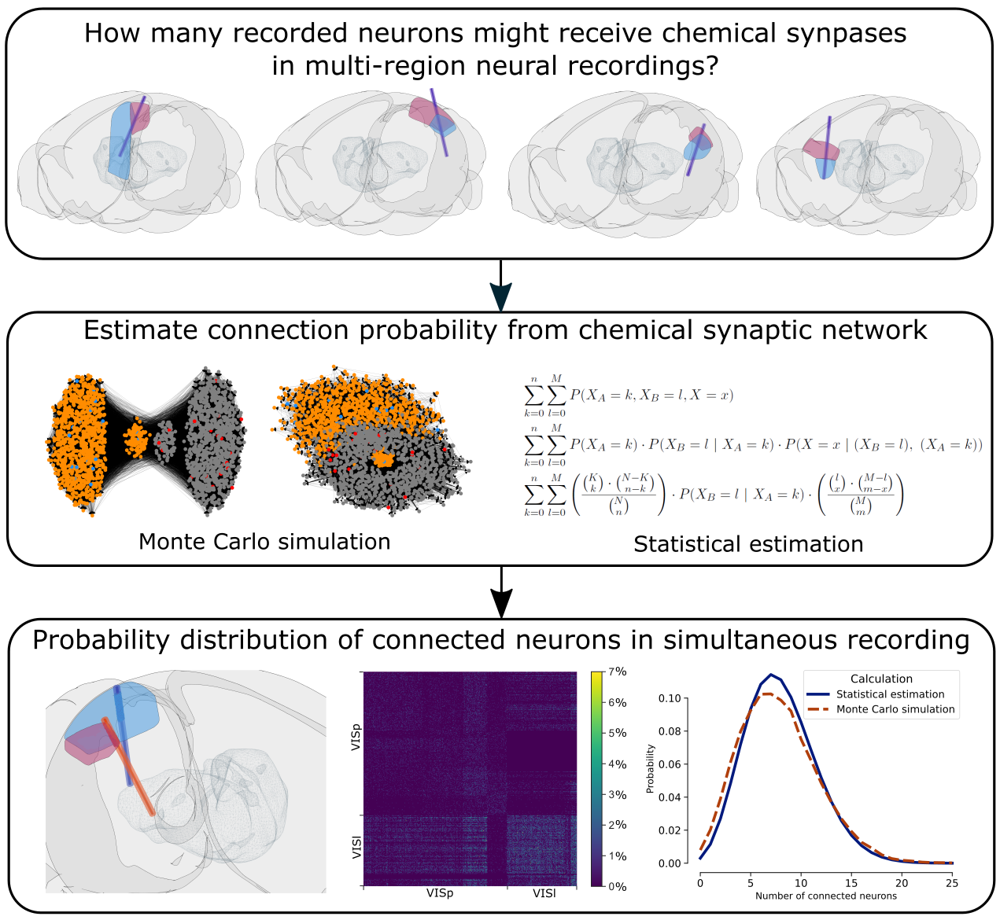
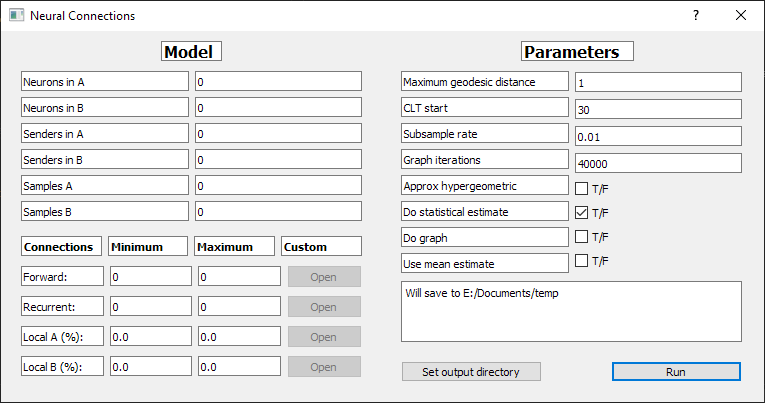

# Simulating and estimating neural connection probability

[](https://doi.org/10.5281/zenodo.6401535)



## General usage

### Installation

```
git clone https://github.com/seankmartin/NeuralConnections
cd NeuralConnections\Code
pip install -r requirements.txt
```

### Graphical user interface

To run the code to perform statistical estimations and graph simulations of neural connection probability,
the main entry point is `python Code\ui.py` to show a PYQt5 GUI like so




### Command line interface

One can use the command line interface, with configs stored in the configs folder.
This offers a bit more flexibility than the GUI, use the `-h` flag to show help.

For example:

```
cd Code
python cli.py --cfg tetrode_ca1_sub.cfg
```

### Code documentation

Documentation is available at [GitHub Pages](https://seankmartin.github.io/NeuralConnections/)

### Citation

This software repository can be cited from Zenodo at https://doi.org/10.5281/zenodo.4311795. 

## Further usage

If you are looking to further contribute to this project, or verify the results, then please read on.

### Building code documentation

Minimal code documentation is available at Code\docs\neuroconnect.

They can be rebuilt with the following commands.

```
cd Code
pdoc neuroconnect --html -o docs -f
cd ..
```

### Blue brain resources

Please place in the Code\resources folder everything from [our OSF repository](https://osf.io/u396f/).

### Steinmetz et al. dataset

Download from https://figshare.com/articles/dataset/Distributed_coding_of_choice_action_and_engagement_across_the_mouse_brain/9974357

### Reproducing all the figures

To reproduce all the figures, it will probably take about half a day on a decent computer.
To do so, run the following command after downloading all the blue brain resources:

```
cd Code
python -m neuroconnect.produce_figures produce-figures
```

### Figure 1

#### Inputs

1. `configs\recurrent_fig.cfg`
2. `configs\recurrent_fig1.cfg`

#### Outputs

1. `results\explain_fig2_1.txt`
2. `results\explain_fig2_1.pdf`
3. `figures\nx_simple_{FIRST_TIME}.png` this is for recurrent_fig.
4. `figures\nx_simple_{SECOND_TIME}.png` this is for recurrent_fig1.
5. `figures\explain_fig_pmf.pdf`

### Figure 2

#### Inputs

Note use of regular expressions below:

1. `resources\left_hemisphere\VISl_.*\.npz`
2. `resources\left_hemisphere\VISp_.*\.npz`
3. `resources\Steinmetz_et_al_2019_9974357`

#### Outputs

1. `figures\brainrender\brainrender_visl_visp.png`
2. `figures\brainrender\brainrender_visl_visp_shifted.png`
3. `figures\full_matrix_vis_VISl_VISp.pdf`
4. `figures\probe_matrix_vis_visl_VISp.pdf`
5. `figures\probe_matrix_vis_visl_VISp_shifted.pdf`
6. `results\atlas_plot.txt`
7. `results\sub_VISp_VISl_stats_all_ds.csv`
8. `results\sub_VISp_VISl_depth_1.csv`
9. `results\original-visp-visl-stats.pdf`
10. `results\shifted-visp-visl-stats.pdf`
11. `results\original-visp-visl-sub-all-depths.pdf`
12. `results\shifted-visp-visl-sub-all-depths.pdf`


### Figure 3

#### Inputs

1. `resources\right_hemisphere\.*\.npz` regular expression for all neocortical regions in OSF.

#### Outputs

1. `figures\brainrender\{Region1}_to_{Region2}_render.png` for all brain region pairs.
2. `figures\{Region1}_to_{Region2}_matrix_subbed.pdf` for all brain region pairs.
3. `results\sub_regions_{Region1}_{Region2}_depth_1.csv` for all brain region pairs.
4. `results\mouse_region_exp_probes.csv`
5. `figures\mouse_region_exp.pdf`
6. `figures\bhattacharyya_mouse.pdf`
7. `figures\mc_mat_vis_MOp_to_SSP-ll.pdf`

### Figure 4

#### Inputs

1. `configs\tetrode_ca3_ca1_full.cfg`
2. `configs\ca3_ca1.cfg`
3. `configs\ca1_sub_high.cfg`
4. `configs\ca1_sub_high_out.cfg`
5. `configs\ca1_sub_low.cfg`
6. `configs\ca1_sub_vhigh.cfg`

#### Outputs

1. `results\samples_depth_ca3_ca1.csv`
2. `figures\ca3_ca1_samps_depth.pdf`
3. `results\tetrode_full.csv`
4. `figures\ca3_ca1_tetrode_pmf.pdf`
5. `results\npix_man.csv`
6. `figures\npix_pmf.pdf`
7. `results\connection_samples_hc_vhigh.csv`
8. `results\connection_samples_hc_high.csv`
9. `results\Connection_samples_hc_high_out.csv`
10. `results\connection_samples_hc_low.csv`
11. `figures\samples_hc_both.pdf`
12. `results\20_sub_vhigh.csv`
13. `results\20_sub_high.csv`
14. `results\20_sub_out.csv`
15. `results\20_sub_low.csv`
16. `figures\ca1_sub_tet_comp.pdf`

### Profiling the code

The code can take a long time to run. To profile it for performance improvements, run

```
cd Code
python profile_this.py ARGS
```

Where `ARGS` are what you would pass to `cli.py`.
